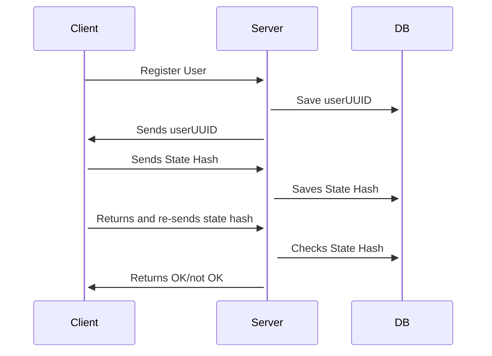
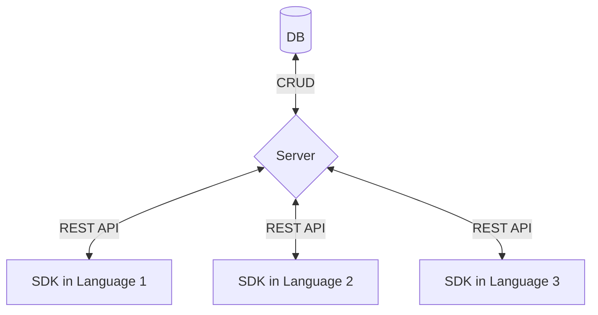

# Continue Bee

*Continue Bee* (50 points to anyone who gets the reference) is a lightweight implementation of the [Sessionless][sessionless] authentication protocol, which allows implementers to save a hash of client state, and then check that state when a client returns.

## Overview

Continue Bee is composed of a CRUD server and database pair, and companion client-side libraries.
This repo defines the contract between client and server via REST API, provides database implementation(s) for storing the models used in that contract, and the methods necessary in a client implementation.

The typical usage will look something like:



And here's what the architecture looks like:



## API

It doesn't get much CRUDier than this API:

<details>
 <summary><code>PUT</code> <code><b>/user/create</b></code> <code>Creates a new user if pubKey does not exist, and returns existing uuid if it does.</code></summary>

##### Parameters

> | name         |  required     | data type               | description                                                           |
> |--------------|-----------|-------------------------|-----------------------------------------------------------------------|
> | publicKey    |  true     | string (hex)            | the publicKey of the user's keypair  |
> | timestamp    |  true     | string                  | in a production system timestamps prevent replay attacks  |
> | signature    |  true     | string (signature)      | the signature from sessionless for the message  |


##### Responses

> | http code     | content-type                      | response                                                            |
> |---------------|-----------------------------------|---------------------------------------------------------------------|
> | `200`         | `application/json`                | `{"userUUID": <uuid>}`   |
> | `400`         | `application/json`                | `{"code":"400","message":"Bad Request"}`                            |

##### Example cURL

> ```javascript
>  curl -X PUT -H "Content-Type: application/json" -d '{"publicKey": "key", "timestamp": "now", "signature": "sig"}' https://www.continuebee.com/user/create
> ```

</details>

<details>
 <summary><code>GET</code> <code><b>/user/:uuid?timestamp=<timestamp>&hash=<hash>&signature=<signature></b></code> <code>Returns whether last saved hash matches sent hash</code></summary>

##### Parameters

> | name         |  required     | data type               | description                                                           |
> |--------------|-----------|-------------------------|-----------------------------------------------------------------------|
> | timestamp    |  true     | string                  | in a production system timestamps prevent replay attacks  |
> | hash         |  true     | string                  | the state hash saved client side
> | signature    |  true     | string (signature)      | the signature from sessionless for the message  |


##### Responses

> | http code     | content-type                      | response                                                            |
> |---------------|-----------------------------------|---------------------------------------------------------------------|
> | `200`         | `application/json`                | `{"userUUID": <uuid>}`   |
> | `400`         | `application/json`                | `{"code":"400","message":"Bad Request"}`                            |

##### Example cURL

> ```javascript
>  curl -X GET -H "Content-Type: application/json" https://www.continuebee.com/<uuid>?timestamp=123&hash=hash&signature=signature 
> ```

</details>

<details>
  <summary><code>POST</code> <code><b>/user/:uuid/save-hash</b></code> <code>Returns whether last saved hash matches sent hash</code></summary>

##### Parameters

> | name         |  required     | data type               | description                                                           |
> |--------------|-----------|-------------------------|-----------------------------------------------------------------------|
> | timestamp    |  true     | string                  | in a production system timestamps prevent replay attacks  |
> | hash         |  true     | string                  | the state hash saved client side
> | signature    |  true     | string (signature)      | the signature from sessionless for the message  |


##### Responses

> | http code     | content-type                      | response                                                            |
> |---------------|-----------------------------------|---------------------------------------------------------------------|
> | `200`         | `application/json`                | `{"userUUID": <uuid>}`   |
> | `400`         | `application/json`                | `{"code":"400","message":"Bad Request"}`                            |

##### Example cURL

> ```javascript
>  curl -X POST -H "Content-Type: application/json" -d '{"timestamp": "right now", "hash": "hash", "signature": "signature"}' https://www.continuebee.com/user/<uuid>/save-hash
> ```

</details>

<details>
  <summary><code>DELETE</code> <code><b>/user/:uuid</b></code> <code>Deletes a uuid and pubKey</code></summary>

##### Responses

> | http code     | content-type                      | response                                                            |
> |---------------|-----------------------------------|---------------------------------------------------------------------|
> | `200`         | `application/json`                | `{"deleted": true}`   |
> | `400`         | `application/json`                | `{"code":"400","message":"Bad Request"}`                            |

##### Example cURL

> ```javascript
>  curl -X DELETE https://www.continuebee.com/<uuid>
> ```

</details>

## Databases

One of the biggest benefits of Sessionless is that it doesn't need to store any sensitive data.
This means all of the data Continue Bee cares about can all be saved in a single table/collection/whatever-other-construct-some-database-may-have.
And that table looks like:

----------------------
| uuid | pubKey | hash

uuid, and pubKey should have unique constraints (Sessionless generated keys and uuids should not collide, but since this is a public API people may just reuse keys and uuids).

## Client SDKs

Client SDKs need to generate keys via Sessionless, and implement the networking to interface with the server. 
To do so they should implement the following methods:

`checkForUser()` - Checks if keys have been generated, and a uuid exists (all of these should be stored in secure storage of the client)--this is the Sessionless check for if a user is logged in.

`createUser()` - Should generate keys, save them appropriately client side, and PUT to /user/create.

`saveHash(hash)` - Should POST the passed in hash to /user/:uuid/save-hash.

`checkHash(hash)` - Should GET to check the saved hash on the client against the saved hash on the server via /user/:uuid?timestamp=timestamp&hash=hash&signature=signature.

`deleteUser(uuid)` - Should DELETE a user by calling /user/:uuid.


## Use cases

**NOTE** Continue bee is experimental, and the instance at continuebee.com is ephemeral, and may go away or reset at any time.
If you're making the next Palworld and want to use continuebee, you're advised to self-host it, or contact zach@planetnine.app to help him upgrade the micro instance it runs on :).

* If you have a game with some state stored locally, say gems a user has acquired, and you don't want them to mess with the number of gems, you can use continuebee to save their gem number periodically, and then check that number when they return to the game.

* You can use continuebee as straight auth for your backend instead of other auth providers.

* You can use continuebee for account continuity before using more intrusive auth layers.
I.e. instead of having potential players bounce off because of needing to enter their email/password before playing, you can auth with continuebee, and then ask for email/password when they hit level five after they've been hooked.

* Just use it as a practice backend before figuring out all the auth needs of your game/app. 

## Self-hosting

This is a bit dependent on what the server implementations are, so we'll fill the details in later, but the idea is that continuebee is hostable by others either for public use like the main instance, or private use.

## Contributing

To add to this repo, feel free to make a [pull request][pr].

[pr]: https://github.com/planet-nine-app/continuebee/pulls
[sessionless]: https://www.github.com/planet-nine-app/sessionless

